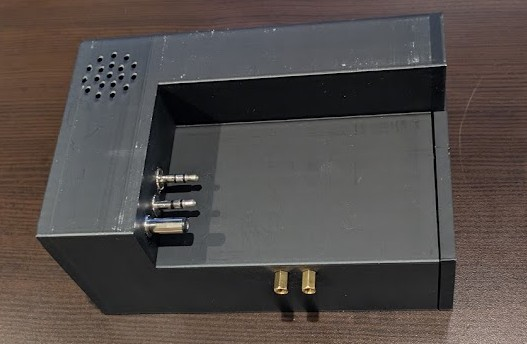
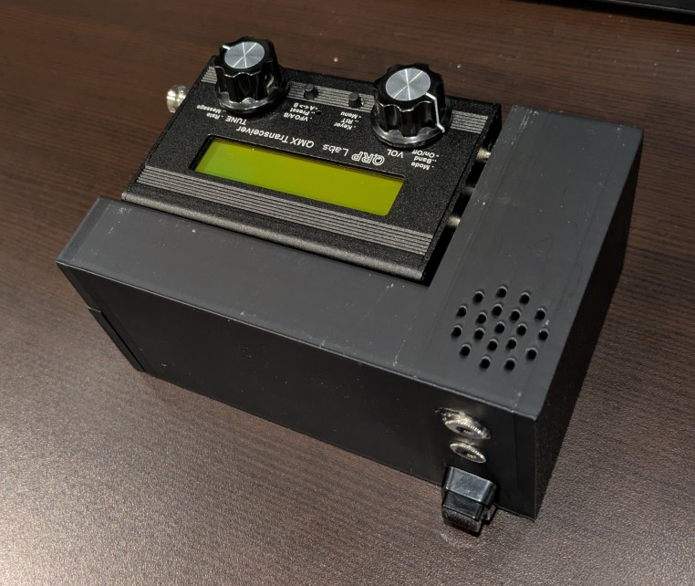
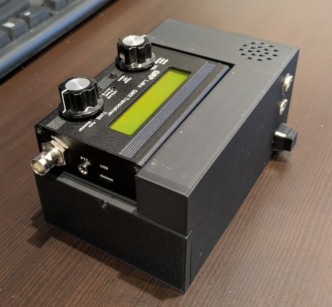
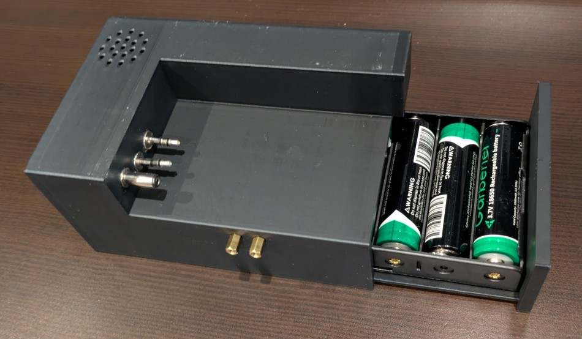
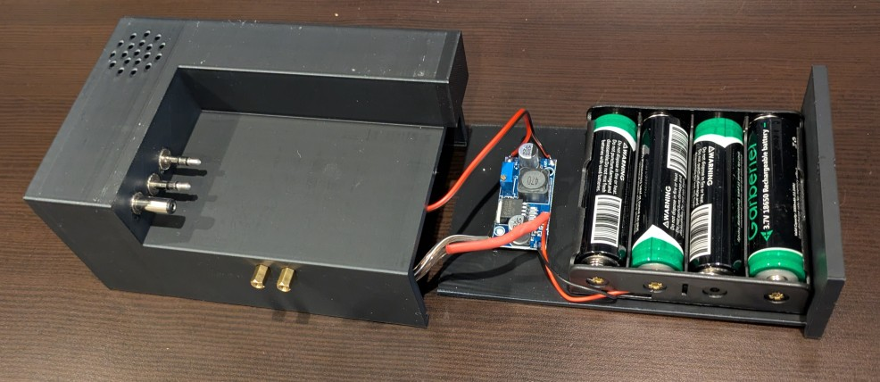
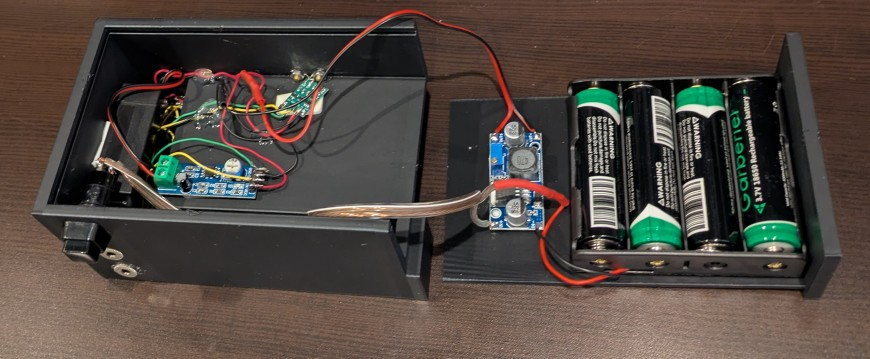
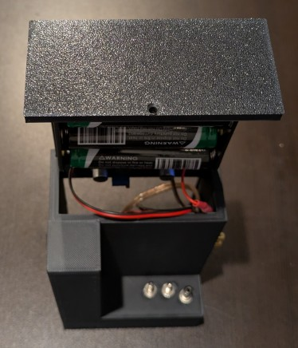

# qmx_appendage

## Why

Over the past year or so, I have really been enjoying participating in SOTA.  I have leaned on my trusty [QRPLabs QMX](https://qrp-labs.com/qmx.html) for nearly all of those SOTA activations.  But having the audio, paddle, and battery wires dangling from it felt a bit messy and prone to getting caught on something and jerked around.  Having [found out the hard way](https://groups.io/g/QRPLabs/message/126261) that the QMX does not like having its cables jerked around, and having recently given my teenage son a 3D printer for his birthday, I was inspired to try to design and print a simple adapter that could stay plugged in while switching modes and batteries.

I wanted the solution to:
* not require any changes to the QMX
* result in only the coax and data cables being needed
* accommodate future experimentation

This was is my first ever FreeCAD project and first ever mechanical design project.  So I'm sure there are mistakes and unnecessarily complicated parts of the design.  I'd love to get feedback if anyone sees something dumb in the FreeCAD model tree for this project.  Everyone is welcome to use the design under the Apache 2.0 license.  If you'd like to collaborate on this project, that would be welcomed.

But there is no guarantee whatsoever that this will work for you and not burn your house down or destroy your QMX.  The use of Lithium Ion batteries and charging systems comes with risks that are outside the scope of this simple 3D print project.

## Parts Used in My Own Version 0.1 Implementation

For a first protoype, I used mostly cheap Chinese components.  Here are links to the ones I used.  I have not done enough field testing to actually recommend any of these.  But they are a place to start.
* [Push switch](https://www.aliexpress.com/item/3256807089124851.html)
* [Buck converter](https://www.aliexpress.com/item/3256805900353604.html)
* [Battery holder](https://www.aliexpress.com/item/3256801768847464.html)
* [Audio amplifier](https://www.aliexpress.com/item/3256808447242473.html)
* [Speaker](https://www.aliexpress.com/item/3256807706299820.html)
* [Plugs](https://www.aliexpress.com/item/3256809479681412.html)
* Power plug and audio jacks – from my junk box

## Construction

I found that hot glue adheres very well to PLA.  So I used hot glue to affix the battery holder to the lid, tack down wires, and reinforce the headphone jack.  I used 3M double-sided sticky pads to hold the circuit boards to the case.  It remains to be seen if the buck converter gets hot enough to melt it.  I used pretty ugly point-to-point wiring for all the connections using wire I had laying around.  Some of it was solid copper and I consider that a mistake.  Next time, I will use decent quality stranded copper hookup wire instead.

## Future Enhancements

* QMX with feet.  In version 0.1, it is assumed that the rubber feet have not been installed on the QMX.  Since many people do install the feet, it would be nice to have an alternate design to accommodate the feet.
* Shrink it.  In version 0.1, the appendage is  bigger than the QMX itself (it is closer to the QMX+ in size).  This is due to the large battery pack.  Smaller battery packs can last through a SOTA activation.  Using a smaller battery pack could really shrink the design.
* Power on LED.  Since the audio amp and touch keyer draw a small amount of current it would be helpful to have an exposed LED to indicate when the main switch is turned on.
* Movable plugs.  In version 0.1, the plugs are rigidly fixed in position.  An arrangement that allows the plugs to move side-to-side and up-and-down would relieve stress on the QMX jacks.
* Add charging port.  There is easily room in the box for a BMS. And the BMS will need an additional jack for charging.
* Change the power button.  It's too easy to accidentally engage the power button in a backpack.  Either a button cover is needed or a different switch
* Fix the threading.  The threading for the plugs and jacks is not perfect so there is some wabble.  In some cases a little hot glue may be needed.  These should be fixed.
* Make the left side open-able.  Soldering in that narrow cavity is very awkward.
* Loosen the lid.  The lid currently fits very tightly.  This is both a feature (makes the retaining screw unnecessary) and a bug (it's pretty hard to slide).
* Add a headless Raspberry Pi and wireless phone based display.  It would be pretty cool to run full wsjt-x rather than using FT8CN on my phone using a data cable.
* Wiring improvements and suggested wiring plan.

## Gallery

### Version 0.1

